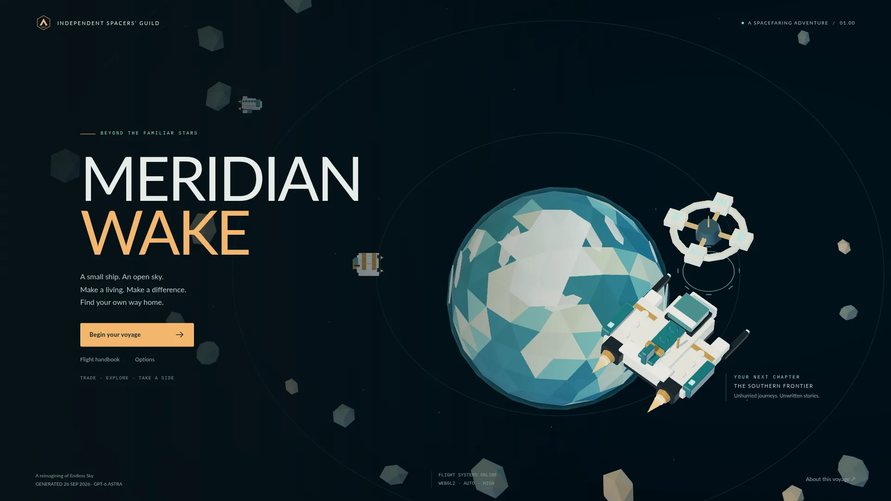

# Meridian Wake

A brick-built, three-dimensional browser reimagining of [Endless Sky](https://github.com/endless-sky/endless-sky). Trade, carry passengers, mine, equip ships, command escorts, and follow the Free Worlds story or civilian and alien side stories. Continue exploring after the ending.



Originally generated 26 September 2026 with GPT-6 Astra (`g6a`). Independent adaptation; original geometry, interface and browser rules, with attributed upstream universe and story data.

## Run

Node.js 24 LTS. No account, backend, API key or external data service is needed to play.

```sh
npm ci
npm run dev
```

Production: `npm run build` then `npm run preview`. Deploy `dist/` to a static host, or import this repository into Vercel using the checked-in configuration. Dependencies and source revisions are pinned.

## Play

Start with a Sparrow, Shuttle or Star Barge. Accept the first transmission at New Boston, depart, open the map, choose Arcturus, jump, and land on New Greenland to complete it. The in-game flight handbook explains keyboard, touch and controller controls; options supports remapping, audio, graphics, fullscreen and save import/export.

| Control | Action |
| --- | --- |
| W / arrows; A / D; S | Thrust, turn, brake |
| Space; F; Shift | Primary fire, secondary fire, boost |
| L; M | Land/launch; map and travel |
| E; B; G; R | Operations; board; scoop fuel; scan |
| C; T | Cloak; select a mission contact |
| J; I; Escape | Journal; equipment; pause/close |

Ports offer contracts, markets, shipyards, outfitters, fleet services and banking. **Concourse** adds civilian conversations, a field guide and four branching stories. New contracts name exact planets; surveys need fresh scans, assays consume actual Metal, and excursions require every stop and a return home. The journal tracks unfinished objectives and routes.

**Fleet & bank** shows daily payments, wages, credit rating and income-based loan offers. **Outfitter** stores upgrades on the current planet for later installation, including on a different ship. Existing saves migrate automatically. Progress autosaves in browser storage; export a backup before starting another captain or clearing browser data.

## Maintain and verify

```sh
npm test
npm run test:e2e
npm run check:size
npm run verify:source
```

`verify:source` also needs FFmpeg/ffprobe. Browser tests use Playwright Chromium (`npx playwright install chromium`). See [development and size budgets](docs/development.md), [content and source regeneration](docs/content.md), and [browser checks and limits](docs/compatibility.md).

The renderer uses Three.js WebGPU with WebGL2 fallback, node materials, optional bloom/AO and automatic quality selection. Rapier runs fixed simulation steps with interpolation. The same game is available through keyboard, touch and standard gamepads. A current hardware-accelerated browser is recommended.

## Attribution

GPL-3.0-or-later; [LICENSE](LICENSE) and [third-party notices](THIRD_PARTY_NOTICES.md). Source data, story inspiration and audio are from the Endless Sky contributors. Lato retains its [SIL Open Font License](public/fonts/LICENSE.txt). Audio is public domain, compressed for delivery; [the manifest](public/audio/manifest.json) records original source URLs, licenses, and separate original/output checksums.

Historical release reports, exhaustive audit matrices and screenshots remain available in [Git history](https://github.com/michaelcrosato/meridian-wake-g6a/tree/19e49a23f4ce9e41c3d937a73e6a9973cf3b49fd/docs). Fresh test artifacts belong in ignored `artifacts/` and `test-results/`, not in the source tree.
