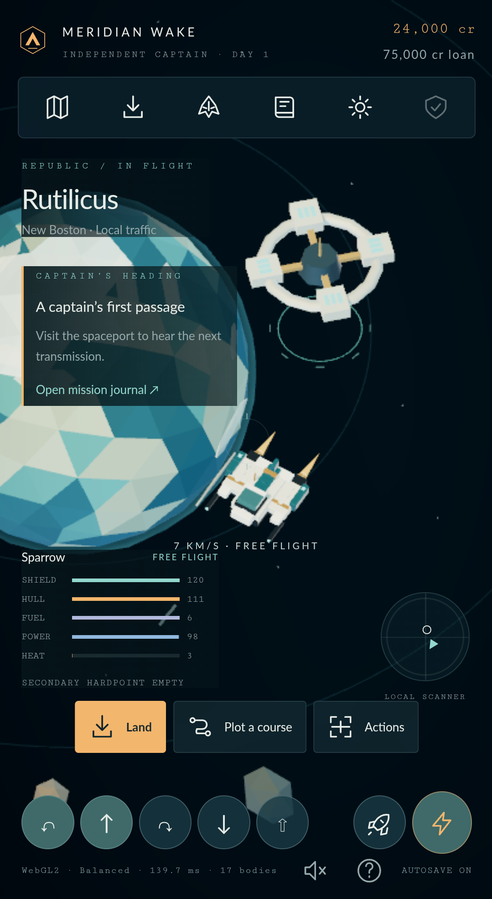
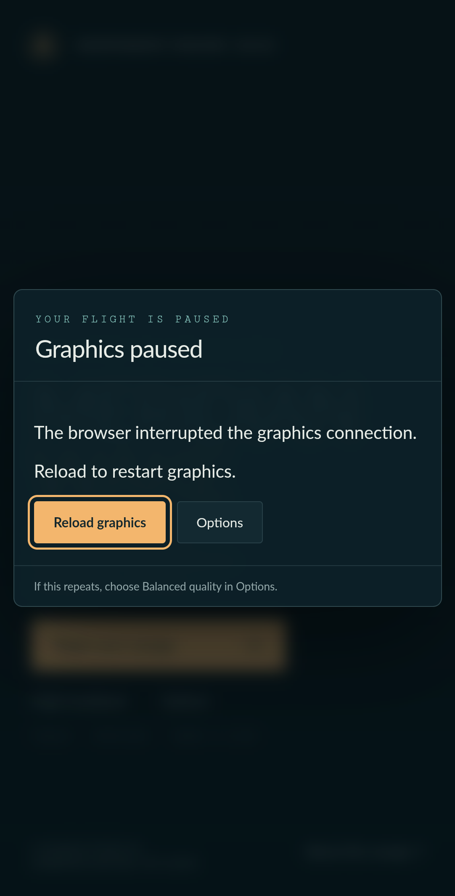

# Android compatibility evidence

Observed **26 September 2026, America/Vancouver**. The original production game rendered correctly and completed the touch journey below in an actual Android browser running inside the owned emulator. The passing configuration was an **official AndroidDesktop Chromium snapshot with ANGLE Vulkan**, not stable branded Chrome Mobile or a physical phone.

| Environment | Recorded value |
| --- | --- |
| Android | Android 16 / API 36, x86_64 `medium_phone` AVD |
| Browser | Chromium **156.0.8076.0**, official `AndroidDesktop_x64` snapshot **1705635**, isolated package `org.chromium.chrome` |
| Actual rendering backend | **WebGL2**, ANGLE Vulkan, Mesa **llvmpipe / LLVM 21** software rendering |
| Controls check | Balanced, 411 × 750 CSS pixels, DPR 2.625 |
| Input | Trusted `Input.dispatchTouchEvent` events in the native Android browser |

The snapshot came from the Google storage bucket linked by the [official Chromium download instructions](https://www.chromium.org/getting-involved/download-chromium/). Exact archive/APK SHA-256 hashes, matching Google bucket MD5, source revision, and sanitized observations are retained in [android-compatibility-evidence.json](android-compatibility-evidence.json). Browser flags were:

```text
--disable-features=WebGPU --enable-features=Vulkan --use-angle=vulkan
--disable-fre --no-first-run --enable-automation --remote-debugging-port=9222
```

WebGPU was deliberately disabled to verify the WebGL2 path. Although a host D3D12/NVIDIA emulator configuration was also tried, the passing browser renderer reported **software Vulkan/llvmpipe**. These observations are not a phone-GPU benchmark.

| Check | Result |
| --- | --- |
| Simultaneous thrust, left turn, and primary fire | Three held controls; speed reached 5.43 units/s, heading changed −0.28 → −1.93 radians, power dipped to 96.88 and heat reached 3.3. Releasing all touches cleared all held controls. |
| Map and jump | A trusted touch selected **Arcturus directly on the SVG chart**; the game changed systems. |
| Automatic landing | Landing approach physically reached the berth and entered **New Greenland Spaceport**. |
| Second-finger discrete action | A cloak tap preserved held thrust and the same control DOM node. Dragging the second finger away did not toggle cloak. Releasing all touches cleared the hold; opening the map also cleared it. |
| Runtime errors | No game JavaScript page errors during the completed journey. |

The cloak check imported [earned-epilogue.json](../tests/fixtures/earned-epilogue.json) through the save-import UI. That checkpoint was earned by the rules traversal and **was not earned during this Android session**. This was a representative control journey, not a full Android campaign playthrough.

| Passing native current-Blink flight | Chrome 133 recovery after context loss |
| --- | --- |
|  |  |

Both screenshots retain their original pixels and dimensions through lossless WebP conversion. They show different browser configurations, not a before/after application fix.

**Failed paths and limits:** the SDK's Chrome **133.0.6943.137** produced black or corrupted scenes under the emulator's SwiftShader, configured swangle, and host-GLES paths. Current Chromium 156 also failed under ANGLE over host-GLES translation. An isolated lit PBR cube failed too. Chrome 133 lost its WebGL context under Vulkan flags; the production recovery UI paused play and offered reload. The tentative renderer workarounds were discarded because the unchanged game rendered correctly on the tested ANGLE Vulkan path.

The AndroidDesktop snapshot additionally hit a **native Java assertion in `keyboard_accessory.ManualFillingComponentBridge.show`** when the search field received focus. The completed journey used chart selection, so native search typing is not certified by this result. Browser initialization and healthy telemetry alone were insufficient: screenshots were inspected before recording a rendering pass.

A separate check of the Auto-quality correction selected Balanced after **7.302 seconds**, reducing bodies from 29 to 17. Its foreground-wall-time and background-gap regressions are recorded in [renderer-audit-evidence.json](renderer-audit-evidence.json). No physical-phone sustained FPS, thermal, battery, latency, or complete Android device/browser matrix claim is made. The owned emulator was stopped after collecting this evidence.
